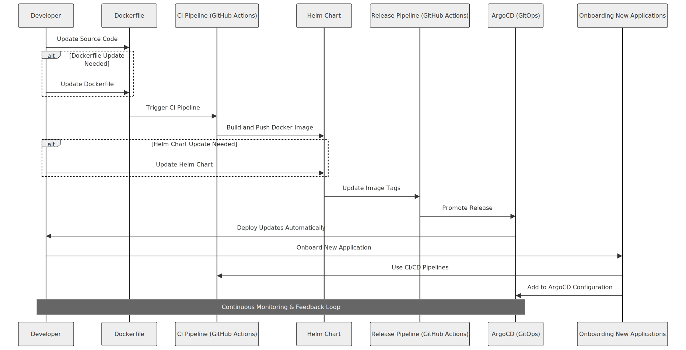

# Leaflink Weather Service Deployment Guide

## Table of Contents

- [Introduction](#introduction)
- [Project Overview](#project-overview)
- [Tech Stack](#tech-stack)
- [Pre-requisites](#pre-requisites)
- [Infrastructure Setup](#infrastructure-setup)
- [Deployment Process](#deployment-process)
- [GitHub Actions Pipelines](#github-actions-pipelines)
- [GitOps with ArgoCD](#gitops-with-argocd)
- [Making Changes and Updates](#making-changes-and-updates)
- [Onboarding New Applications](#onboarding-new-applications)
- [Vault and Monitoring Integration](#vault-and-monitoring-integration)
- [Handover Checklist](#handover-checklist)
- [Conclusion](#conclusion)

## Introduction

This guide provides comprehensive information on the deployment and management of the `weather-service`, detailing the tech stack and offering guidelines for future maintenance and updates.

## Project Overview

- **Weather Service**: A micro service which displays the weather in New York City when you issue a GET /weather request.

Service is designed to run in isolated environment and exposed through a reverse proxy or load balancer.

## Tech Stack

- Docker
- Kubernetes
- Helm Charts
- Terraform
- ArgoCD
- GitHub Actions
- Vault (for secrets management) (Not Implemented)
- Monitoring Tools (for system observation) (Not Implemented)

## Pre-requisites

- **Docker Desktop** with Kubernetes enabled.
- **Helm**: Kubernetes package manager.
- **Terraform CLI**: For managing infrastructure as code.
- Kubeconfig File for Kubernetes interactions.
- Terraform Inputs: Kubeconfig file path, ArgoCD version, and domain name for ingress.

## Changes made to the weather microservice

- **Gunicorn**: Updated the pyproject.toml to include Gunicorn for better performance in production environments.

## Infrastructure Setup

1. **Terraform**: Used to set up and configure the ingress controller and ArgoCD with ingress in the local Docker Desktop Kubernetes cluster.
2. **Kubernetes Cluster**: Host the services.
3. **Ingress Controller**: Manage external access.
4. **Vault**: To be mounted for secrets management.
5. **Monitoring Stack**: Integration for system monitoring and alerting.

## Local Environment setup

- **Gunicorn**: Ensure you have updated the pyproject.toml to include Gunicorn: gunicorn = "^20.0.4"
- **Run Container**: To run the Docker container locally with an API key:
    - docker build -t weather-service .
    - docker run -p 8080:8080 -e API_KEY='Your_API_Key_Here' weather-service
- **Create a Kubernetes generic secret for the API key**: kubectl create secret generic api-key --from-literal=API_KEY='Your_API_Key_Here'
- **Terraform Commands**: Before running Terraform commands, ensure your kubeconfig file is correctly set up for Docker Desktop Kubernetes. Then execute the following:
    terraform init
    terraform plan
    terraform apply

## Deployment Process

1. **Docker Images**: Built and pushed to Docker Hub via CI pipeline.
2. **Helm Charts**: Manage service deployment.
3. **ArgoCD**: Monitors and triggers deployment based on Helm chart changes.

The following diagram illustrates the development and deployment process for services:

## GitHub Actions Pipelines

### CI Pipeline

- Builds and pushes Docker images.
- Trigger on push to main branch. 
- Requires DockerHub username and personal access token to be added as secret.
- Can be updated for alternative registries like ECR, JFrog or Quay.
- Can be used to trigger based on PR.

### Release Pipeline

- Updates image tags in Helm charts.
- Manul trigger, requries image tag.
- Updates the image tag in the helm chat values file. 
- Utilizes a GitHub personal access token with repo scope added as a secret to commit changes.

## GitOps with ArgoCD

- **Apps of Apps Approach**: Centralizes management of multiple applications.
- **ArgoCD Directories**:
  - `/argocd/`: Entry point for Argo CD applications.
  - `/argocd/apps/{service-name}`: Contains ArgoCD files for each service.

## Making Changes and Updates

1. Update service code base.
2. Trigger CI pipeline for Docker image updates.
3. Modify Helm charts as needed.
4. ArgoCD deploys updates automatically.

## Onboarding New Applications

1. Create a Dockerfile for the new application.
2. Develop a Helm chart for Kubernetes deployment.
3. Use CI/CD pipelines in GitHub Actions.
4. Add a configuration file for the new service in ArgoCD.

## Vault and Monitoring Integration (Not Implemented)

- **Vault**: Securely manage secrets within the applications.
- **Monitoring Tools**: Implement tools like Prometheus and Grafana for real-time monitoring and alerting.

## Handover Checklist

- [ ] Review Dockerfiles and Helm charts.
- [ ] Understand the GitHub repository structure and workflows.
- [ ] Familiarize with Terraform scripts for infrastructure setup.
- [ ] Learn ArgoCD setup and GitOps practices.
- [ ] Test the entire deployment process.
- [ ] Verify Vault and Monitoring stack integration.

## Conclusion

This guide is designed to facilitate an efficient handover of the project, providing insights into the infrastructure and deployment processes.

**For Further Assistance**: Kwaku | kwakudabanka@gmail.com